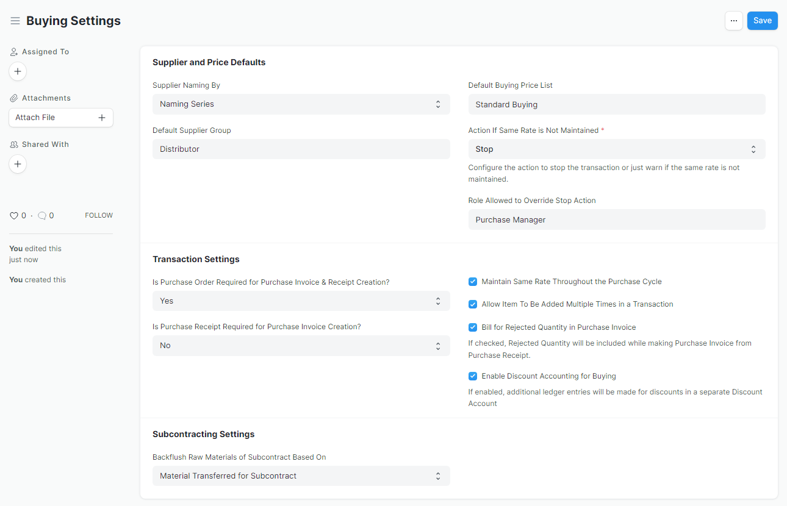

#  Buying Setting
Buying Settings is where you can define properties which will be applied in the Buying module's transactions

### 1. create new email domain 
Go to `Buying > Setting > Buying Settings` 

### 2. configure new domain email 
Fill your configuration acording to following image

    * for namingSeries, please see the reference

### 3. save
Hit `save` button and you're done.

----------------------

### Reference
https://docs.erpnext.com/docs/v13/user/manual/en/buying/buying-settings

https://docs.erpnext.com/docs/v13/user/manual/en/setting-up/settings/naming-series
