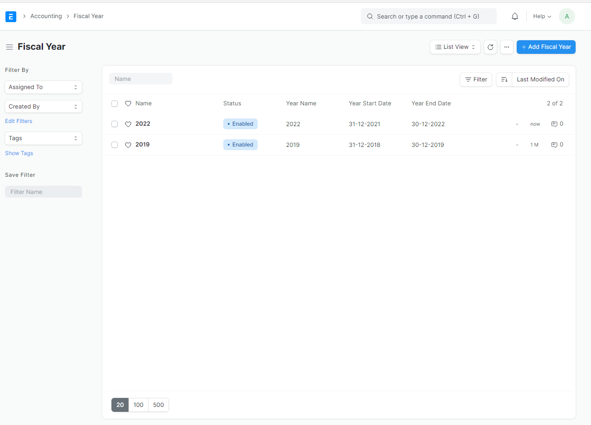

# Default warehouse Account
You'll prompted to set default warehouse account before processing purchase transaction.

### 1. create new email domain 
Go to `Accounting > Company` 

### 2. select company you want to edit
click desired company, and update the stock settings

### 3. save
Hit `save` button and you're done.

----------------------

### Reference
