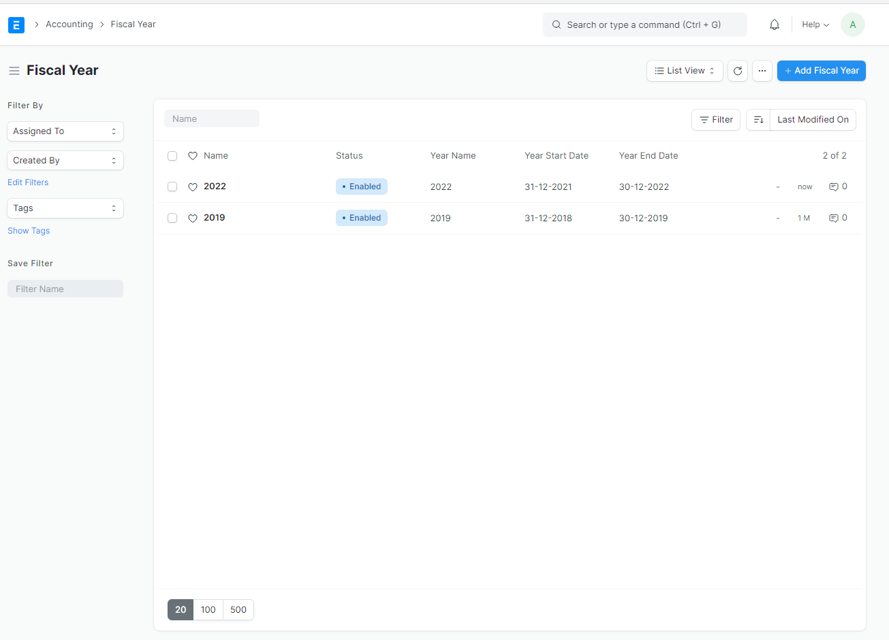
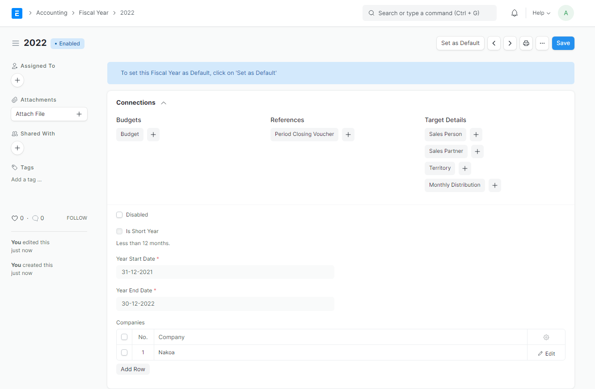

#  Buying Setting
Buying Settings is where you can define properties which will be applied in the Buying module's transactions

### 1. create new email domain 
Go to `Accounting > Accounting Master > Fiscal Year` 

### 2. configure new domain email 
Set your default fiscal with current current fiscal year (now year).Create new if current year not available yet.

### 3. save
Hit `save` button and you're done.

----------------------

### Reference
https://docs.erpnext.com/docs/v13/user/manual/en/accounts/articles/fiscal-year-error

https://docs.erpnext.com/docs/v13/user/manual/en/accounts/fiscal-year