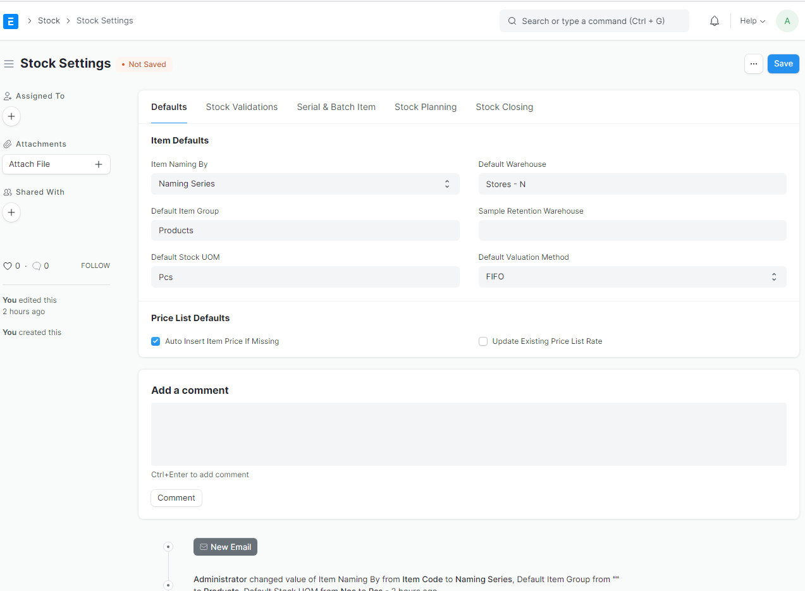

#  Item Setting
Item setting, helps you format item naming, and set item rules config

### 1. Config item setting 
Go to `Stock > Stock Settings` 

### 2. configure
set default `item naming by` to `Naming Series`,  `Default Stock UOM`, and choose your `default warehouse`

### 3. save
Hit `save` button and you're done.

----------------------

### Reference
https://docs.erpnext.com/docs/v13/user/manual/en/stock/stock-settings