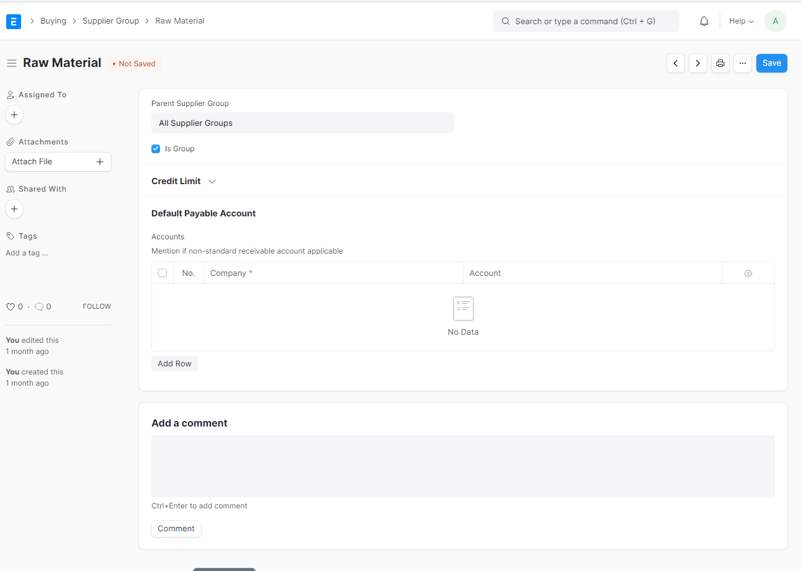

#  Supplier Group
Here you can set supplier grouping.

### 1. create new email domain 
Go to `Buying > Supplier > Supplier Group` 

### 2. Edit group as supplier parent
select group you want to make parent, click edit and tick `Is Group` checkbox

### 3. Set default payment terms 
If needed, you can setup default paynent for suppler group, for example: if your suppliers take half payment on sales order and half post shipment.

### 4. save
Hit `save` button and you're done.

----------------------

### Reference
https://docs.erpnext.com/docs/v13/user/manual/en/buying/supplier-group
