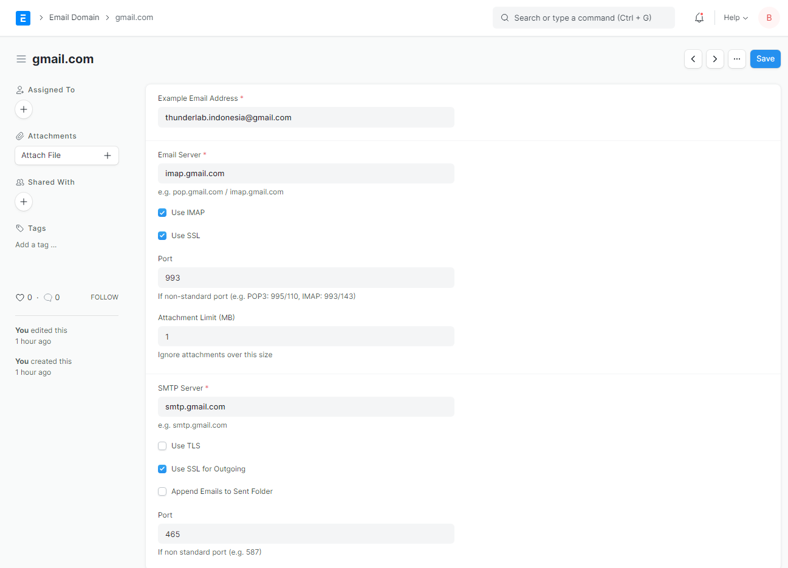

# Default Email Config
example of this case will using gmail as email service provider

### 1. create new email domain 
Go to `settings > email domain` and create `new domain`

### 2. configure new domain email 
Fill your configuration acording to following image

### 3. save
Hit `save` button and you're done.
