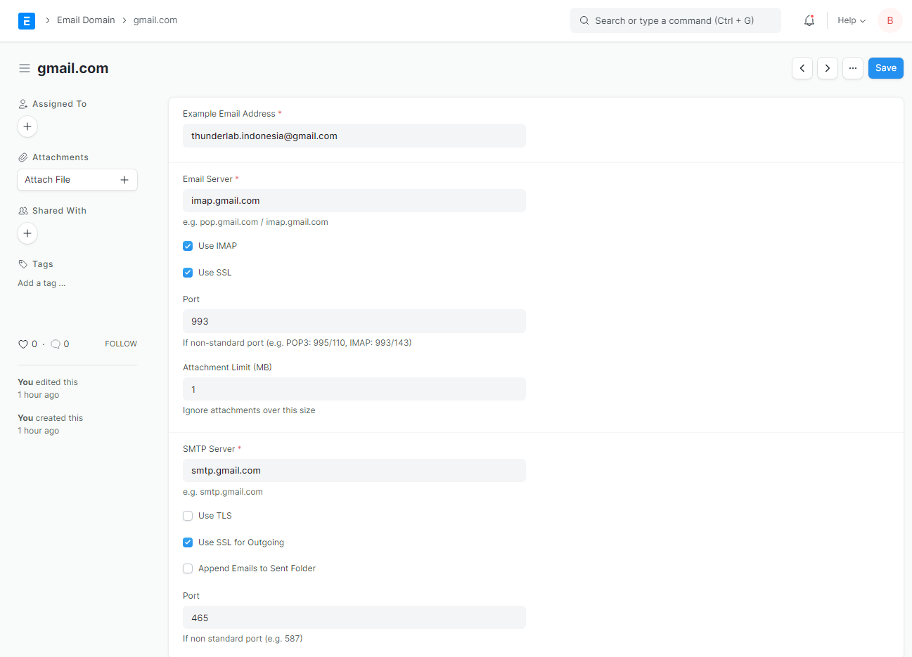

#  Email Domain
this email configuration will be used as template to your all email account used by this application to send/receive email.

## Gmail Configuration

### 1. create new email domain 
Go to `settings > email domain` and create `new domain`

### 2. configure new domain email 
Fill your configuration acording to following image

### 3. save
Hit `save` button and you're done.

----------------------

### Reference
https://docs.erpnext.com/docs/v13/user/manual/en/setting-up/email/email-domain
