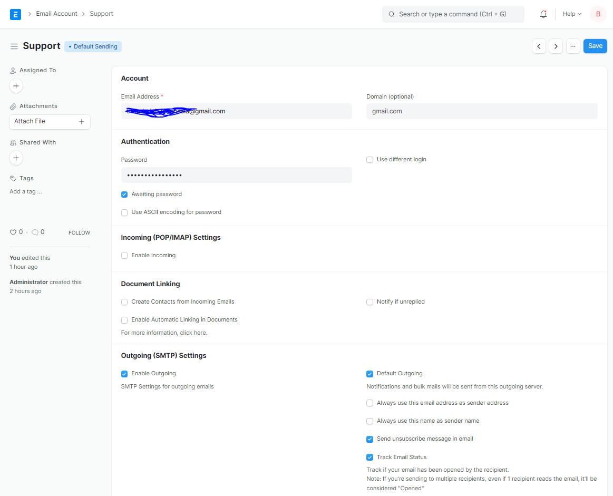

# Email Account
Email account are account(from your email provider) that being use to send/receive email from certain actions/orgs.

Basically this config are used for send welcome email, reset password, and thisng taht related to customer support activity inside erpnext.

open `settings > email account` and select `Support`

## Using Google account

### 1. Account Preparation
First, you need to activate your `2FA` on your gmail account, and create new `apps password` to continue. For further documentation, please look [here](https://docs.erpnext.com/docs/v13/user/manual/en/setting-up/email/email_account_setup_with_gmail)

### 2. Configure Account
Once your Gmail account ready, fill your configuration to matchthis following image.

### 3. save
Hit `save` button and you're done.

Notes
* Dont forget to test your configuration by resetting your (random) user password, to confirm that erpnext successfully sending `reset password email`.

* It may take long time for email come into your inbox, so its a good idea to check your ougoing/sent email from your email account that you register in this process (on this case, check your sent email from your gmail)

-----------

### Reference
https://docs.erpnext.com/docs/v13/user/manual/en/setting-up/email/email-account

https://docs.erpnext.com/docs/v13/user/manual/en/setting-up/email/email_account_setup_with_gmail