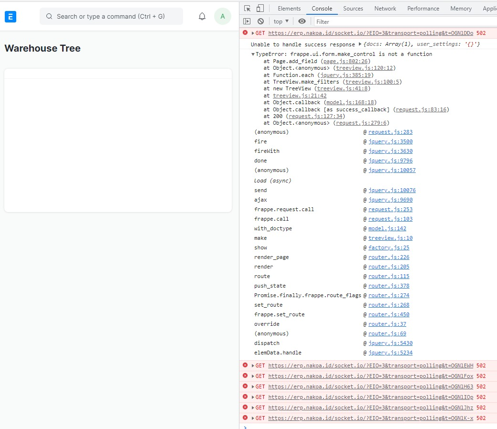

#  JS - Form.input error
This error can be caused by update posted by erpnext/frappe developer team that requires specific environment.

## Pip3 Version
On this case, the problem caused by pip3 version. Erpnext use pip3 modules called html5lib which is deprecated on pip version 21+. 

Downgrading your pip to version 20.3.4 shall fix the issue

### Steps
1. SSH to your server, and login as non root account to stop your frappe applications

        sudo service supervisor stop
        sudo service nginx stop

2. Check your `pip3` version, if version > 21 you should continue this following steps

3. downgrade your pip

        pip install pip==VERSION

4. restart your server

        sudo reboot

5. Check if problem is solved. If not, you can consider beckup your site, and create fresh install or backup from server snpashots and restore your application from your backup file

### Reference
[html5lib](https://github.com/pypa/pip/issues/10825)
[backup](../recovery/backup.md)
[restore](../recovery/restore.md)